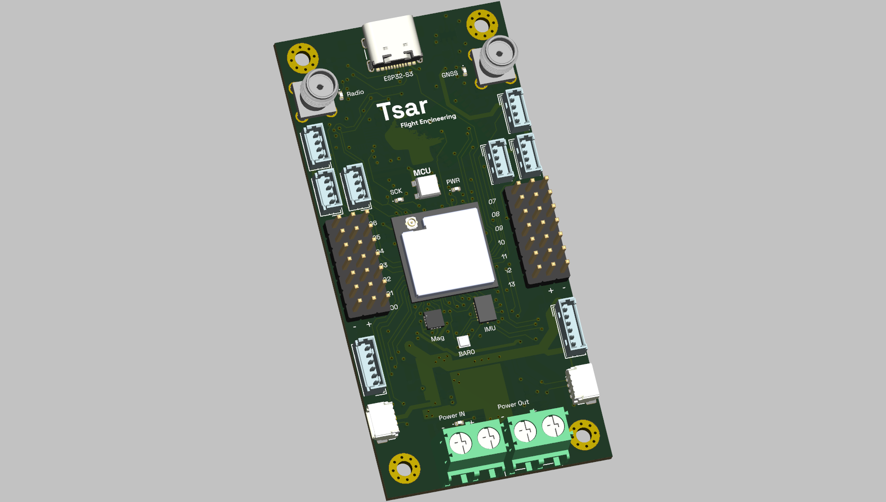
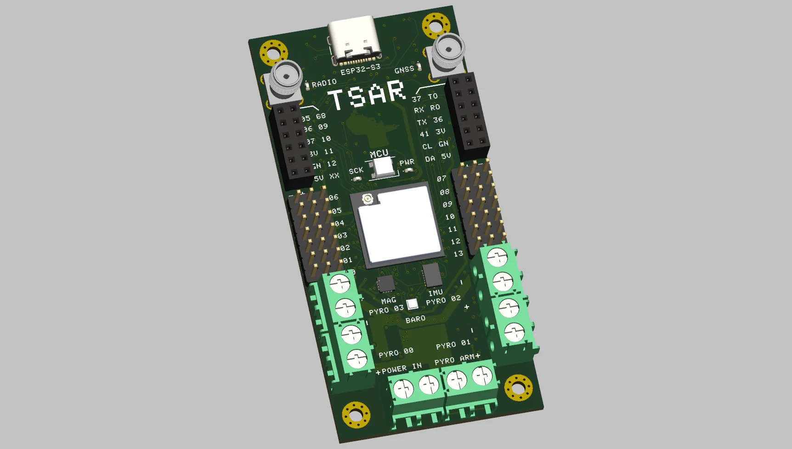
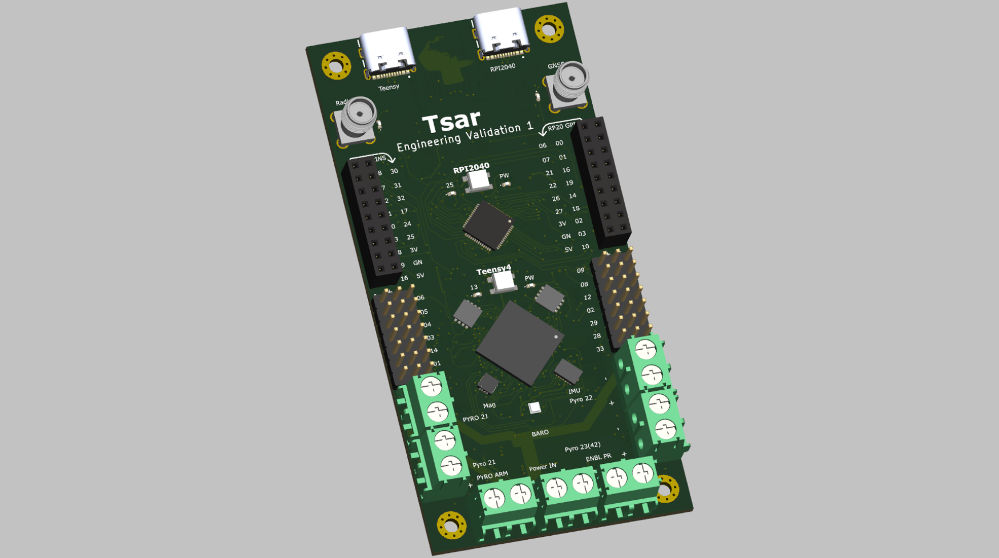

## Flight Computer

The repository contains flight computers I was developing for my autonomous vehicles. The goal was to build a general-purpose & fully programmable flight computer that can be used for any autonomous model vehicles. It intended design as to be modular, cost-effective, and easy to manufacture.

The PCB is designed in KiCad and updated to version 8.0.3.

## V3 [Latest Version]

The design is very similar to V2 but with different IO style and no pyro channels, the secondary chip is STM32G0 for lower no. of components. The design is still in progress.

- Main Dual core ESP32-S3.
- Secondary STM32G0 as an IO extender.
- 2.4GHz SX1280 radio.
- Ublox-M10S GNSS.
- BMI088 IMU upto ± 24 g, ± 2000°/s
- BMP390 barometer (upto 10KM), MMC5983MA magnetometer for heading.
- SD card and flash (eps32-s3 inbuilt) for data logging & storage.
- 14 PWM channels ( combined 3A ).
- ~ 20 auxiliary outputs with SPI, I2C, analog, digital pins, etc.
- 6-16v power input, (reverse+over+under)-voltage, over-current protection.
- 40mm width, 82mm height.

## V2 [April 2024]

With the learnings from V1, I designed V2. The design was more cost-effective, less complex, and easy to manufacture. The BOM cost was around 60-80$ and the board with 4 layers. Trace width and minimum clearence of 0.2mm, QFN chips, and 0603 components, it was easy to manufacture and assemble. The board was manufactured and partially tested. The board was never used in any flight (yet).

- Main Dual core ESP32-S3.
- Secondary RP2040 as an IO extender.
- 2.4GHz SX1280 radio.
- Ublox-M10S GNSS.
- BMI088 IMU upto ± 24 g, ± 2000°/s
- BMP390 barometer (upto 10KM), MMC5983MA magnetometer for heading.
- 4 pyro channels (upto 16V, 4A) with contiunity.
- SD card and flash (eps32-s3 inbuilt) for data logging & storage.
- 14 PWM channels ( combined 3A ).
- 17 auxiliary outputs with SPI, I2C, analog, digital pins, etc.
- 6-16v power input, (reverse+over+under)-voltage, over-current protection.
- 40mm width, 82mm height.

## V1 [March 2024]

My first attempt at designing a flight computer. The design was powerful by using Teensy but it was highly complex, less cost-effective. The BOM cost was around 120-150$ and the board with 4 layers. With trace width and minimum clearence of 0.127mm, BGA chips, and 0402 components, it was hard to manufacture and assemble. The board was never manufactured or tested.

- Main Chip NXP IMXRT106DVJ6B ( Teensy 4.1 ).
- RP2040 as an IO extender.
- 2.4GHz SX1280 radio.
- Ublox-M10S GNSS.
- BMI088 IMU upto ± 24 g, ± 2000°/s
- BMP390 barometer (upto 10KM), MMC5983MA magnetometer for heading.
- 4 pyro channels (upto 16V, 4A) with contiunity.
- SD card and flash (eps32-s3 inbuilt) for data logging & storage.
- 14 PWM channels ( combined 3A ).
- 30 auxiliary outputs with SPI, I2C, analog, digital pins, etc.
- 6-16v power input, (reverse+over+under)-voltage, over-current protection.
- 50mm width, 100mm height.
